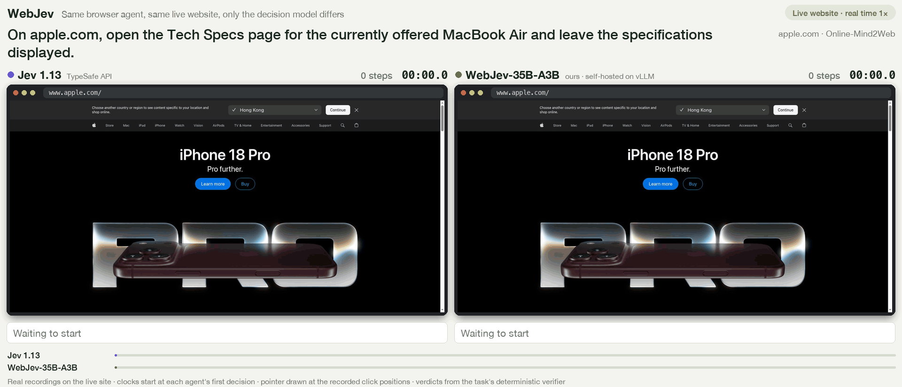
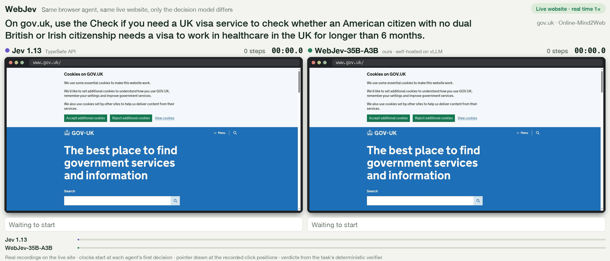
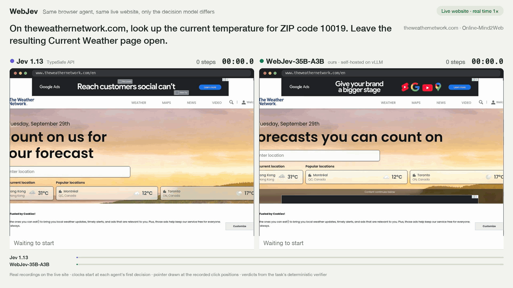
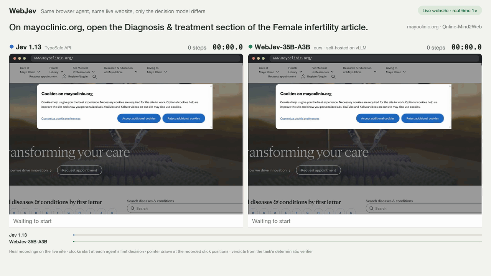
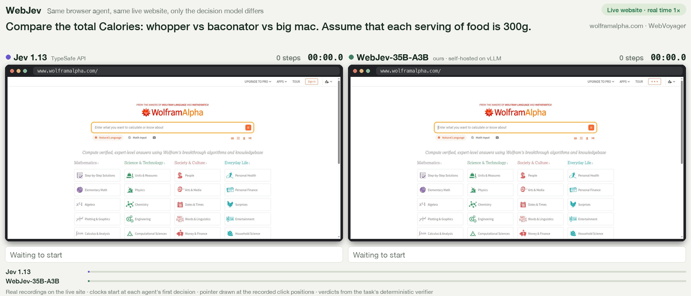
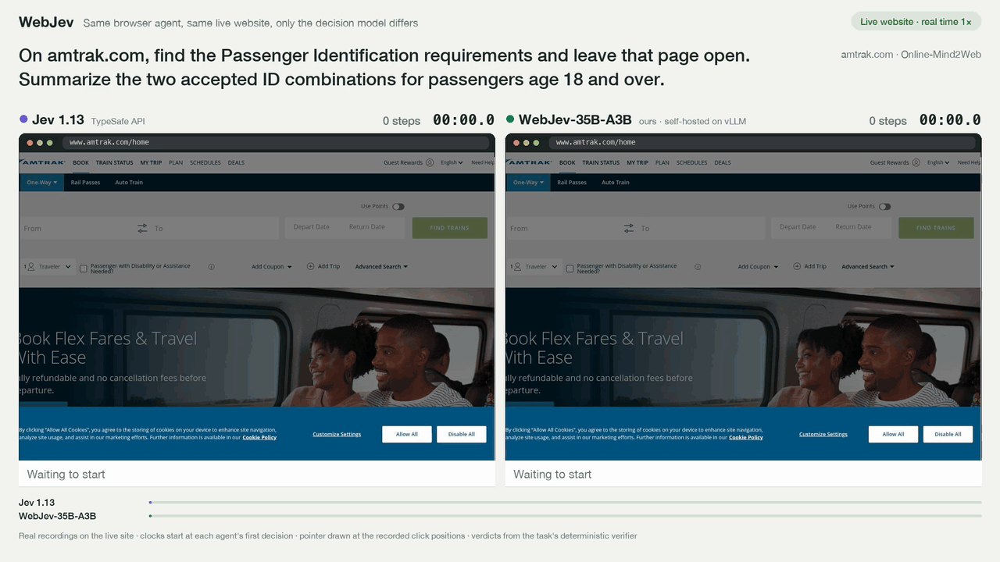

# WebJev

**Jev-like decision models specialized for browser use.** Given a live web page, WebJev picks the next action in a
single forward pass.

<p align="center">
  
</p>
<p align="center"><sub>Same browser agent, same live website; only the decision model differs.
Left: Jev 1.13. Right: WebJev-35B-A3B. Real time. Verdicts come from the task's deterministic verifier.</sub></p>

We ran **125 real-website tasks**, each graded by a deterministic verifier. Both models drive the same browser agent,
**[jev-ultrafast](https://github.com/browser-use/jev-ultrafast)** by Browser Use, and only the decision model is swapped. **WebJev-35B-A3B completes 38.5% of the tasks and Jev 1.13 completes 16.7%.** On 8 public
single-step decision benchmarks the two models are close (83.7% vs 84.7% mean accuracy).

| | WebJev-35B-A3B | Jev 1.13 |
| --- | ---: | ---: |
| Real-website tasks, success rate (125 tasks) | **38.52%** | 16.67% |
| Single-step decision benchmarks, mean of 8 | 83.72% | **84.70%** |

## Showcase

Here are six tasks from the 125-task set on which WebJev succeeded and Jev failed in the benchmark run. We recorded each task
three more times per model with the same agent (jev-ultrafast), cloud browser and text helper, and the task's own verifier graded every
take. **On these six tasks WebJev succeeded in 16 of 18 takes, Jev in 0 of 18.** Each GIF shows one take per model in real
time.

| Task | Site | WebJev-35B-A3B | Jev 1.13 | How Jev fails |
| --- | --- | --- | --- | --- |
| Open the Tech Specs page of the current MacBook Air (above) | apple.com | ✓ 3/3 takes · 5 steps | ✗ 0/3 | Opens the buy page, then keeps clicking the search icon |
| Does a US citizen need a visa for a 6+ month healthcare job? | gov.uk | ✓ 2/3¹ · 16 steps | ✗ 0/3 | Re-selects the same answer and never presses Continue |
| Current temperature for ZIP code 10019 | theweathernetwork.com | ✓ 3/3 · 2 steps | ✗ 0/3 | Presses Search instead of the suggested location, then gives up |
| Open the Diagnosis & treatment page of the Female infertility article | mayoclinic.org | ✓ 2/3² · 5 steps | ✗ 0/3 | Gives up at the cookie dialog |
| Compare the calories of a Whopper, a Baconator and a Big Mac (300 g each) | wolframalpha.com | ✓ 3/3 · 4 steps | ✗ 0/3 | Gives up on the home page |
| Find the passenger ID requirements | amtrak.com | ✓ 3/3 · 4 steps | ✗ 0/3 | Keeps clicking the help assistant's search button |

<sub>¹ The third take reached the correct result page, but the text helper answered without the requested JSON field,
so the verifier failed it. ² The third take hit a browser timeout and could not be graded.</sub>

<details open>
<summary><b>gov.uk</b>: WebJev answers every step of the visa checker; Jev keeps re-selecting the same option</summary>

</details>

<details>
<summary><b>The Weather Network</b>: WebJev picks the suggested location in 2 steps; Jev presses Search and gives up</summary>

</details>

<details>
<summary><b>Mayo Clinic</b>: WebJev rejects the optional cookies and gets to the article; Jev stops at the cookie dialog</summary>

</details>

<details>
<summary><b>Wolfram|Alpha</b>: WebJev enters the comparison as one query; Jev gives up on the home page</summary>

</details>

<details>
<summary><b>Amtrak</b>: WebJev navigates the menu to Passenger Identification; Jev loops inside the help assistant</summary>

</details>

Per-take details are in [`assets/gifs/cases.json`](assets/gifs/cases.json).

## What WebJev is

A *decision model* does not write text. It reads a **state** and a set of **typed questions**, and returns a
probability for every option in one forward pass. It is the "System 1" part of an agent: fast, cheap and calibrated.
This is the model family that TypeSafe AI's Jev introduced. WebJev follows the same request and response format, so it
is a drop-in replacement for Jev.

WebJev-35B-A3B is fine-tuned from [Qwen3.5-35B-A3B-Base](https://huggingface.co/Qwen/Qwen3.5-35B-A3B-Base), a
mixture-of-experts model with 35B parameters in total and 3B active per token. Most of its training data is decision data built
from public datasets. We add our own **live-web decision data**, recorded on real websites. The goal is general typed-decision
quality on par with Jev, and much better decisions inside a browser agent.

### How jev-ultrafast uses it

```text
   observe the page ── URL, title, visible text, indexed elements (links, buttons, inputs, selects),
         │             and the last 10 actions
         ▼
   one decision request to WebJev
     ├─ operation?         CLICK · TYPE_TEXT · SELECT · page controls (scroll, wait, Enter, back, Escape) · DONE · BLOCKED
     ├─ click target?      [3] Mac · [12] Search · [27] Tech Specs · ...
     ├─ type_text target?  [5] Search apple.com · ...
     └─ select target?     [9:2] Sort by: Newest · ...
         │  every option gets a probability
         ▼
   execute the most probable operation on its target in the real browser ──► observe again
```

The questions and options come from the page, not from a fixed action list. When the chosen operation needs text, a
separate text helper model writes it, and the same helper writes the final answer to the user. The decision model only
chooses; it never generates text.

## Model

| Model | Base | Parameters | Weights |
| --- | --- | --- | --- |
| WebJev-35B-A3B | [Qwen3.5-35B-A3B-Base](https://huggingface.co/Qwen/Qwen3.5-35B-A3B-Base) | 34.7B total, 3B active (MoE), BF16 | [Lexmount/WebJev-35B-A3B](https://huggingface.co/Lexmount/WebJev-35B-A3B) |

## What is in this repository

| Directory | What you get |
| --- | --- |
| [`train/`](train/) | How to launch training, the training code, and how every part of the training data was built (sources, synthesis, processing scripts). |
| [`evaluation/serving/`](evaluation/serving/) | Serve WebJev on vLLM behind a Jev-compatible API (`/api/alpha/decisions`, `/v1/systemone`). |
| [`evaluation/benchmarks/`](evaluation/benchmarks/) | 8 public single-step decision benchmarks: fetch, run, score. |
| [`evaluation/liveweb/`](evaluation/liveweb/) | The 125-task real-website evaluation: tasks, deterministic verifiers, harness, per-task results. |
| [`apps/browser-agent/`](apps/browser-agent/) | A web app around the jev-ultrafast agent: type a task and watch it operate a real browser, step by step. |

## Browser

WebJev decides and a browser executes. The demo app and the real-website evaluation run on either of two browsers:

| Browser | What you need | Why |
| --- | --- | --- |
| **[Lexmount Browser](https://browser.lexmount.com/)** (recommended) | `LEXMOUNT_API_KEY` and `LEXMOUNT_PROJECT_ID` from [browser.lexmount.com](https://browser.lexmount.com/) | Cloud browser infrastructure for AI agents: isolated browser sessions on demand, with no browsers to deploy or maintain. Many tasks can run in parallel. All our evaluation runs and the GIFs above used it. |
| Your local Chrome | Chrome started with `--remote-debugging-port=9222`, then `BROWSER=local` | Quick tries on your own machine without an account. |

[`apps/browser-agent/`](apps/browser-agent/#browser) shows both setups step by step.

## Quick start

**1. Serve the model** behind the Jev-compatible API (one 80 GB GPU, see [`evaluation/serving/`](evaluation/serving/)):

```bash
huggingface-cli download Lexmount/WebJev-35B-A3B --local-dir ./WebJev-35B-A3B
cd evaluation/serving                                      # create .venv as its README describes
MODEL_DIR=../../WebJev-35B-A3B VENV=.venv ./serve.sh       # API at http://127.0.0.1:8200
```

**2. Try it on real websites.** [`apps/browser-agent/`](apps/browser-agent/) starts a local web page. Pick an example
task or type your own, choose WebJev or Jev, and watch each decision execute in Lexmount Browser or your local Chrome.

**3. Reproduce the evaluations.** [`evaluation/benchmarks/`](evaluation/benchmarks/) covers the single-step
benchmarks and [`evaluation/liveweb/`](evaluation/liveweb/) covers the 125 real-website tasks.

**4. Train.** [`train/`](train/) starts from the base model and builds the data mixture.

## Results

### Real-website tasks

We hand-picked 125 tasks on live websites from [Online-Mind2Web](https://github.com/OSU-NLP-Group/Online-Mind2Web),
[WebGym](https://github.com/microsoft/webgym) and [WebVoyager](https://github.com/MinorJerry/WebVoyager). **Every task
is verifiable.** Each task has a deterministic verifier. Right before the browser session closes, the harness captures
evidence from the live page: the final URL, the open tabs, values read from the page, and the agent's final answer. The
verifier checks that evidence. No LLM decides whether a run succeeded, so the benchmark keeps real websites without the
noise of an LLM judge: the same evidence always gets the same verdict. Every run uses the same agent (jev-ultrafast), the same cloud
browser and the same step budget. Only the decision model changes. See [`evaluation/liveweb/`](evaluation/liveweb/).

| Subset | WebJev-35B-A3B | Jev 1.13 |
| --- | ---: | ---: |
| **All 125 tasks** | **38.52%** (47/122) | 16.67% (20/120) |
| Online-Mind2Web (75) | **38.36%** (28/73) | 16.90% (12/71) |
| WebGym (26) | **32.00%** (8/25) | 8.00% (2/25) |
| WebVoyager (24) | **45.83%** (11/24) | 25.00% (6/24) |

Success rate = successes / gradable tasks. Tasks are excluded when the browser environment failed or the verifier
raised an error. 120 tasks were gradable for both models. On 30 of them WebJev succeeded and Jev failed; on 3 the reverse
happened (both succeeded on 17, both failed on 70).

### Single-step decision benchmarks

| Benchmark | Questions | WebJev-35B-A3B | Jev 1.13 |
| --- | ---: | ---: | ---: |
| JevBench (public items) | 231 | **87.88%** | 85.71% |
| Nimble (eval split) | 324 | **92.90%** | 92.59% |
| SemIf (external items) | 252 | 98.02% | **98.41%** |
| scienthoon support tickets | 873 | **76.29%** | 74.91% |
| kev transfer-v4 (dev) | 764 | 85.08% | **85.21%** |
| kev decision-v7 (dev) | 1,468 | **86.31%** | 83.31% |
| MMLU-Pro (10-way) | 1,000 | 69.40% | **83.40%** |
| typed-decisions (test) | 2,000 | 73.90% | **74.05%** |
| **Mean of 8** | | 83.72% | **84.70%** |

WebJev wins 4 of the 8 benchmarks. Most of the gap in the mean comes from MMLU-Pro, which tests stored knowledge more than
reading a state.

## Training data

We do not ship training data files in this repository. Everything except our web decision data is built from public
datasets. [`train/data/`](train/data/) documents each source and how it was converted or synthesized, and includes the
processing scripts. Our live-web decision data is on Hugging Face:
**[Lexmount/WebJev](https://huggingface.co/datasets/Lexmount/WebJev)**.

## Acknowledgements

- [Mapika/decider](https://github.com/Mapika/decider) (Apache-2.0): the open training framework for one-pass typed
  decision models that our training builds on.
- [browser-use/jev-ultrafast](https://github.com/browser-use/jev-ultrafast) (MIT): the browser agent loop that our
  agent runtime is adapted from.
- [Online-Mind2Web](https://github.com/OSU-NLP-Group/Online-Mind2Web), [WebGym](https://github.com/microsoft/webgym) and
  [WebVoyager](https://github.com/MinorJerry/WebVoyager): the source benchmarks of our real-website tasks.
- The authors of JevBench, Nimble, SemIf, scienthoon's ticket set, kev, MMLU-Pro and typed-decisions for the public
  single-step benchmarks. See [`evaluation/benchmarks/`](evaluation/benchmarks/) for links.
- [Qwen](https://huggingface.co/Qwen) for the base model.

## License

The code in this repository and the WebJev-35B-A3B weights are released under the [Apache License 2.0](LICENSE),
the license of the base model and of the upstream training framework. Third-party components keep their own
licenses; see [NOTICE](NOTICE).

WebJev is an independent project by [Lexmount](https://lexmount.com) and is not affiliated with or endorsed by
TypeSafe AI. Jev is a product of TypeSafe AI.
