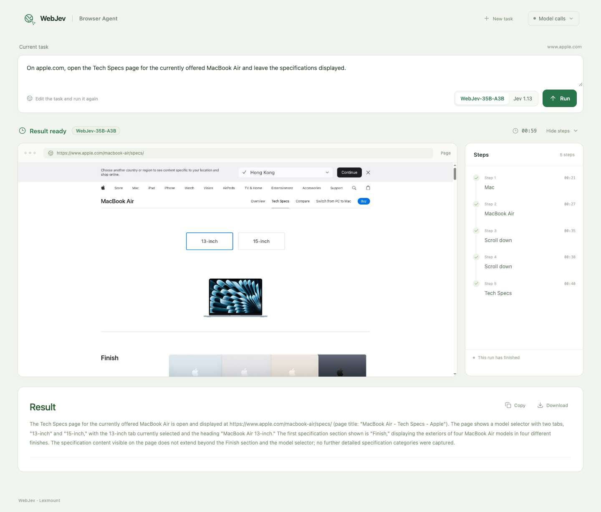

# WebJev Browser Agent

A web page where you type a task for a real website and watch a browser carry it out. The decision model chooses
every browser action; you can switch between **WebJev-35B-A3B** and **Jev 1.13** to compare them on the same task.



## Browser

The agent drives Chrome over the Chrome DevTools Protocol. It can use a cloud browser or the Chrome on your own
machine; everything after the connection is the same code.

### Lexmount Browser (recommended)

[Lexmount Browser](https://browser.lexmount.com/) is Cloud Browser Infrastructure for AI Agents: isolated browser
sessions on demand for browsing, clicking and filling forms, with no browsers to deploy or maintain. Each run gets a
fresh session, and you can watch it live or take over for a sign-in. Our real-website evaluation runs and the GIFs in
the main README used it.

Get an API key and a project ID at [browser.lexmount.com](https://browser.lexmount.com/), then set them in `.env`:

```bash
LEXMOUNT_API_KEY=...
LEXMOUNT_PROJECT_ID=...
```

### Use your local Chrome instead

Start Chrome with remote debugging and a separate profile directory. Recent versions of Chrome ignore
`--remote-debugging-port` on your default profile, so `--user-data-dir` is required.

macOS:

```bash
"/Applications/Google Chrome.app/Contents/MacOS/Google Chrome" \
  --remote-debugging-port=9222 --user-data-dir="$HOME/.webjev-chrome"
```

Linux:

```bash
google-chrome --remote-debugging-port=9222 --user-data-dir="$HOME/.webjev-chrome"
```

Windows (PowerShell):

```powershell
& "C:\Program Files\Google\Chrome\Application\chrome.exe" --remote-debugging-port=9222 --user-data-dir="$env:USERPROFILE\webjev-chrome"
```

Then set `BROWSER=local` in `.env` (and `CHROME_CDP_URL` if you chose another port). Each run opens its own browser
context (a new window with fresh cookies and storage) and closes it at the end; the browser and your other tabs are
never touched. Anything that can reach the debugging port can control that Chrome, so keep it on `127.0.0.1` (the
default) and use a profile without your personal logins.

## How it works

Each run starts a worker process with its own browser session and repeats one loop until the task is done:

1. **Observe.** An in-page script reads the current page: URL, title, visible text (up to 6,000 characters) and the
   interactive elements (up to 250), including elements inside open shadow roots.
2. **Decide.** The runtime asks the decision model two typed questions about that page: which operation to run
   (click, type text, select, scroll, wait, press Enter, go back, press Escape, `DONE` or `BLOCKED`) and which
   element to act on. The model returns a probability for every option in a single forward pass, and the runtime
   executes the most likely one. The request uses the Jev decision API (`state` and `questions`), so WebJev and Jev
   are interchangeable.
3. **Act.** The action runs in the browser. The decision model only chooses; when the operation is "type text",
   a text model writes the value.

The loop stops when the model picks `DONE` or `BLOCKED`, or at the budget (900 seconds, 60 actions). A text model
then writes the answer from the pages the browser saw. In this app the text model also splits the task into stages
and gives a short hint when the agent keeps repeating itself. The real-website evaluation in
[`evaluation/liveweb`](../../evaluation/liveweb) imports this same agent code (`backend/engine.py`) but turns the
planner and the hints off, so that it measures the decision model alone.

Six example tasks on the start page come from that 125-task evaluation: WebJev-35B-A3B completed them and Jev 1.13
did not. Live websites change, so a new run can end differently.

## Requirements

- Python 3.12 or newer, and Node.js 20 or newer to build the page.
- A browser: a Lexmount Browser API key, or a local Chrome started as shown above.
- At least one decision model:
  - **WebJev-35B-A3B**: any Jev-compatible endpoint serving it, such as the server in
    [`evaluation/serving`](../../evaluation/serving). Set `DECISION_URL`.
  - **Jev 1.13**: a TypeSafe API key (`TYPESAFE_API_KEY`) or an OpenRouter API key (`OPENROUTER_API_KEY`).
- An OpenAI-compatible chat API for the text model (`TEXT_MODEL_*`). Our runs use DeepSeek V4.1 Flash.

## Run it

```bash
cd apps/browser-agent
python3 -m venv .venv
.venv/bin/pip install -r requirements.txt
npm --prefix frontend ci
npm --prefix frontend run build
cp .env.example .env            # then fill in your keys
.venv/bin/python -m uvicorn backend.app:app --host 127.0.0.1 --port 8787 --env-file .env
```

Open http://localhost:8787, pick a model, and run an example or type your own task. The badge at the top right shows
which browser the server uses.

With Docker (Lexmount Browser):

```bash
cd apps/browser-agent
cp .env.example .env            # then fill in your keys
docker compose up -d --build
```

Inside the container, `127.0.0.1` is the container itself. If your WebJev server runs on the host, set
`DECISION_URL=http://host.docker.internal:<port>`. To use a local Chrome, run the app directly as shown above.

## Configuration

All settings are server-side environment variables (see [`.env.example`](.env.example)); keys never reach the
browser page.

| Variable | Purpose |
| --- | --- |
| `LEXMOUNT_API_KEY`, `LEXMOUNT_PROJECT_ID` | Lexmount Browser credentials. |
| `CHROME_CDP_URL` | Your local Chrome's debugging endpoint (default `http://127.0.0.1:9222`; a `ws://` URL also works). |
| `BROWSER` | `lexmount` or `local`. Default: `lexmount` when `LEXMOUNT_API_KEY` is set, otherwise `local`. Other values are ignored, since many systems use `BROWSER` for their default web browser. |
| `DECISION_URL`, `DECISION_API_KEY`, `DECISION_MODEL` | WebJev-35B-A3B behind a Jev-compatible endpoint (`POST /api/alpha/decisions`). |
| `TYPESAFE_API_KEY` or `OPENROUTER_API_KEY` | Jev 1.13 (`jev-1.13.0` on TypeSafe, `typesafe/jev-1.13` on OpenRouter; override with `TYPESAFE_MODEL`). |
| `BROWSER_AGENT_DEFAULT_DECISION` | Preselected model when both are configured: `webjev` (default) or `jev`. |
| `TEXT_MODEL_BASE_URL`, `TEXT_MODEL_API_KEY`, `TEXT_MODEL` | Text model for planning, typed text and the final answer (default model name `deepseek-v4.1-flash`). |
| `BROWSER_AGENT_MAX_ACTIVE` | Runs allowed at the same time (default 3). |
| `BROWSER_AGENT_MAX_SECONDS` | Time budget per run (default 900). |
| `BROWSER_AGENT_HOURLY_LIMIT` | Runs per hour for the whole server (default 40). |
| `BROWSER_AGENT_POOL_SIZE` | Lexmount Browser only: idle sessions kept ready to cut start-up time (default 0, off). |
| `BROWSER_AGENT_TIMEZONE` | Time zone for "today" and "tomorrow" in tasks (default `UTC`). |
| `BROWSER_AGENT_SESSION_SECRET` | Key that signs the owner cookie; generated and stored under `runs/` when empty. |
| `BROWSER_AGENT_DATA` | Where runs are stored (default `apps/browser-agent/runs/`). |

## Costs and limits

- Every run uses one browser session (a Lexmount Browser session, or a browser context in your Chrome) and calls the
  decision model once per step, plus the text model a few times. The warm pool, when enabled, keeps that many idle
  cloud browsers running.
- Only public HTTPS websites can be opened. The agent is told to retrieve information only: no purchases, payments
  or registrations.
- When a page asks for a sign-in or a CAPTCHA, the run pauses so that you can finish it in the live view, in the
  session's own viewer (Lexmount Browser) or in your Chrome window (local). The agent never types credentials itself.
- A run is visible only to the browser that started it (a signed cookie). Its frames, steps, model calls and answer
  are stored under `runs/<run-id>/`.
- **Model calls** (top right) lists every decision and text-model call of the current run with its input, output and
  latency; keys are redacted.

## Tests

```bash
.venv/bin/pip install pytest
.venv/bin/python -m pytest tests -q
```

The tests run offline: they never start a browser or call a model.

## Layout

| Path | Contents |
| --- | --- |
| `backend/app.py` | FastAPI app: runs, live event stream, frames, sign-in hand-off, model choice. |
| `backend/worker.py` | One process per run. |
| `backend/engine.py` | The agent loop around the runtime: observation, decisions, stall handling, live frames, summary. |
| `backend/browser_adapter.py` | Browser controls added to the runtime: Back, Enter, popup tabs, clicks inside shadow roots, extra element context. |
| `backend/browser_backend.py` | Which browser a run uses (`BROWSER`). |
| `backend/result.py` | The final answer, written by the text model from the pages the run observed. |
| `backend/session_pool.py` | Optional warm Lexmount Browser sessions. |
| `backend/diagnostics.py`, `backend/transport_diagnostics.py` | Per-run records of model calls and their timings. |
| `backend/presets.py` | The example tasks. |
| `frontend/` | The React page. |
| `vendor/jev_ultrafast/` | The agent runtime, adapted from [browser-use/jev-ultrafast](https://github.com/browser-use/jev-ultrafast); `browser_cdp.py` is the CDP transport with its two browser providers. |

## Third-party code

`vendor/jev_ultrafast` is adapted from [browser-use/jev-ultrafast](https://github.com/browser-use/jev-ultrafast)
(MIT License, see [`vendor/LICENSE`](vendor/LICENSE)). The upstream commit, our changes and file hashes are recorded
in [`vendor/PROVENANCE.json`](vendor/PROVENANCE.json).

WebJev is an independent project by Lexmount and is not affiliated with or endorsed by TypeSafe AI.
